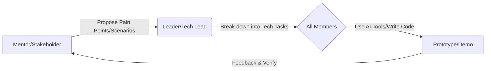

# Team Alignment Guide


### 📌 Purpose
This document helps **Mentors (Community Admin), Leaders (DKU Student), and Team Members (Volunteer)** quickly align and establish an efficient collaboration loop. Whether you have a coding background or not, this is your starting point for the Hackathon journey.


### 🚀 1. Core Collaboration: Collaborate-Learn-Practice Loop

Our collaboration is not a one-way command chain, but a dynamic loop:



#### 👥 Roles
*   **Mentor (Community Admin)**: **The Compass**. Communicates real needs from patients/families (Needs Pool), steers product direction to ensure it "lands at the bedside", and answers medical scenario questions.
*   **Leader (DKU Student)**: **The Helmsman**. Manages the project, breaks down abstract needs into GitHub Issues/Tasks, guides members in using Git, coordinates progress, and ensures code quality and compliance.
*   **Team Member (Participant)**: **The Oarsman**. Uses skills (dev, design, medical knowledge) combined with AI tools to output code, docs, or designs to complete specific tasks.


### 💡 2. Understanding Needs & Communication Rules

Our goal is to **solve real problems**, not just show off skills.

#### 🏥 Needs Source (Where to look)
Please check `/references/seed-ideas-pool`. Key focus areas:
*   **Seven-Color Cards**: Complication management, report interpretation, mental healing, etc.
*   **Community Pain Points**: "Human language" translation of medical reports, therapy scam alerts, diet/medication management.

#### 🛡️ Communication & Compliance Red Lines (The Rules)
1.  **No Real Data**: Development and testing **MUST** use Mock data or LLM-generated desensitized data. Strictly forbidden to upload any real patient names or medical records.
2.  **Empathic Communication**: Many in the community are patients or families. Be patient and respectful. Avoid cold technical jargon; ask "How can this solve your trouble?".
3.  **Open Source Spirit**: Projects default to MIT or similar permissive licenses, aiming to benefit the community, not for closed-source commercialization.


### 🛠️ 3. Quick Start GitHub Collaboration

We use GitHub for code hosting and collaboration.

#### Overview (The Flow)
1.  **Clone**: Download the project locally.
2.  **Branch**: **Do NOT modify main/master directly!** Create new branches for tasks, e.g., `feature-login-page`.
3.  **Commit**: Save your changes.
4.  **Pull Request (PR)**: Request to merge your work into the main branch.

#### Cheatsheet
```bash
# Team Alignment Guide
git clone https://github.com/your-repo.git
cd your-repo

# Team Alignment Guide
git checkout -b feature-login

# Team Alignment Guide

# Team Alignment Guide
git add .
git commit -m "feat: complete login page layout"

# Team Alignment Guide
git push origin feature-login
```
*💡 **Leader Tip**: After members submit a PR, the Leader should Code Review on GitHub and Merge if all is good.*


### 🤖 4. Vibe Coding / Qoder CLI Guide

To help non-tech members contribute code and boost developer efficiency, we encourage using AI coding tools. Special thanks to our tech support partners:
*   **AI Coding Tool (Qoder)**: [https://qoder.com/](https://qoder.com/)
*   **Vibe Coding (Weavefox)**: [https://www.weavefox.cn/](https://www.weavefox.cn/)

#### What is Vibe Coding?
**"Coding by intuitive feeling"**. You don't need to master every line of syntax, just clearly tell AI what you want, AI generates the code, and you verify/adjust.

#### How to use Qoder CLI / AI Assistant?
1.  **Clear Prompts**:
    *   ❌ Bad: "Write a webpage."
    *   ✅ Good: "I need a mobile webpage with an input for 'blood glucose level' and a 'Save' button. Clicking save logs data to console and clears input. Use TailwindCSS, modern and clean style."
2.  **Iterate**:
    *   Generate basic version -> Run & Check -> Find issues -> Tell AI to fix -> Run again.
3.  **Error Handling**:
    *   If you see errors, paste them to AI: "I got this error [error message], please fix."

#### Advice for Non-Tech Members
*   Think of yourself as a **Product Manager** or **Architect**.
*   Your core skill is **Defining Problems** and **Accepting Results**.
*   Leave tedious coding to AI; focus on smooth experience and meeting Mentor's needs.


### 📅 5. Action Items

1.  **All**: Join the group chat, introduce yourself in one sentence.
2.  **Leader**: Create GitHub repo, upload empty `README.md`, invite members as Collaborators.
3.  **Mentor**: Pick a specific direction from the Needs Pool (e.g., simple "Medication Expiry Reminder").
4.  **Members**: 
    *   Install env (Node.js, Git, Cursor/VSCode).
    *   Run "Hello World": Clone repo -> Change one line -> Submit PR -> Leader merge.

> **We are not racing to code fast, but racing to deliver warm technology to those in need.**
> *Let's Hack for Good!*


