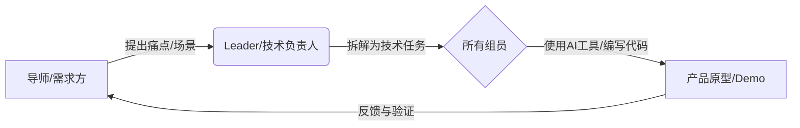

# 小X宝社区 x DKU 黑客松 - 小组对齐手册


### 📌 文档目的
本文档旨在帮助**导师 (Community Admin)、Leader (DKU Student)、组员 (Volunteer)** 快速达成共识，建立高效协作循环。无论你是否具备编程背景，这里都是你开启黑客松之旅的起点。


### 🚀 1. 核心协作模式：合作-学习-实践循环

我们的协作不是单向的指令下达，而是一个动态循环：



#### 👥 角色分工
*   **导师 (Community Admin)**: **指南针**。负责传达一线患者/家属的真实需求（需求池），把控产品方向，确保不偏离"落地到床边"的初衷，并解答医疗场景问题。
*   **Leader (DKU Student)**: **舵手**。负责项目管理，将抽象需求拆解为GitHub Issue/Task，指导组员使用Git工具，协调开发进度，确保代码质量与合规性。
*   **组员 (参赛者)**: **划桨手**。利用自身技能（开发、设计、医学知识）结合AI工具，输出代码、文档或设计稿，完成具体任务。


### 💡 2. 理解需求与沟通规则

我们的目标是**解决真实问题**，而非单纯炫技。

#### 🏥 需求来源 (Where to look)
请查阅 `参考文档/需求池-种子.md`。核心关注点：
*   **七色卡矩阵**: 并发症管理、病情解读、心理疗愈等。
*   **社区痛点**: "人话"翻译医疗报告、疗法避雷、饮食/服药管理。

#### 🛡️ 沟通与合规红线 (The Rules)
1.  **绝对禁止真实数据**: 开发测试**必须**使用Mock数据（模拟数据）或LLM生成的脱敏数据。严禁上传任何真实患者姓名、病历图。
2.  **同理心沟通**: 社区里许多是患者或家属，沟通时请保持耐心与尊重。避免使用过于冷漠的技术术语，多问"这能帮您解决什么麻烦？"。
3.  **开源精神**: 项目默认采用MIT等宽松协议，旨在造福社区，而非商业闭源。


### 🛠️ 3. 极速上手 GitHub 协作

我们统一使用 GitHub 进行代码托管与协作。

#### 流程概览 (The Flow)
1.  **Clone (克隆)**: 将项目下载到本地。
2.  **Branch (分支)**: **不要在主分支(main/master)直接修改！** 根据任务创建新分支，如 `feature-login-page`。
3.  **Commit (提交)**: 保存你的更改。
4.  **Pull Request (PR)**: 请求将你的成果合并到主分支。

#### 常用指令速查 (Cheatsheet)
```bash
# 小X宝社区 x DKU 黑客松 - 小组对齐手册
git clone https://github.com/your-repo.git
cd your-repo

# 小X宝社区 x DKU 黑客松 - 小组对齐手册
git checkout -b feature-login

# 小X宝社区 x DKU 黑客松 - 小组对齐手册

# 小X宝社区 x DKU 黑客松 - 小组对齐手册
git add .
git commit -m "feat: 完成登录页面布局"

# 小X宝社区 x DKU 黑客松 - 小组对齐手册
git push origin feature-login
```
*💡 **Leader提示**: 小组成员提交PR后，Leader应在GitHub网页端进行Code Review（代码审查），确认无误后点击Merge。*


### 🤖 4. Vibe Coding / Qoder CLI 实战指南

为了让非技术背景的组员也能贡献代码，或者让开发者效率倍增，我们鼓励使用 AI 编程工具。本活动特别感谢以下企业的技术支持：
*   **AI 编程工具 (Qoder)**: [https://qoder.com/](https://qoder.com/)
*   **Vibe Coding (Weavefox)**: [https://www.weavefox.cn/](https://www.weavefox.cn/)

#### 什么是 Vibe Coding?
**"跟着感觉写代码"**。你不需要精通每一行语法，只需要清晰地告诉AI你想实现什么，AI负责生成代码，你负责验证和调整。

#### 如何使用 Qoder CLI / AI 助手?
1.  **清晰的Prompt (提示词)**:
    *   ❌ 差: "帮我写个网页。"
    *   ✅ 好: "我需要一个移动端网页，包含一个输入框用于输入'血糖值'，还有一个'保存'按钮。点击保存后，将数据打印在控制台，并清空输入框。使用TailwindCSS编写样式，风格要现代简洁。"
2.  **迭代开发 (Iterate)**:
    *   先生成基础版 -> 运行查看 -> 发现问题 -> 告诉AI修复 -> 再运行。
3.  **错误处理**:
    *   遇到报错信息，直接把错误复制给AI："我运行后出现了这个错误 [错误信息]，请帮我修复。"

#### 给非技术背景组员的建议
*   把自己想象成**产品经理**或**建筑师**。
*   你的核心能力是**定义问题**和**验收结果**。
*   把繁琐的代码实现交给AI，你专注于体验是否流畅、功能是否满足导师提出的需求。


### 📅 5. 立即行动 (Action Items)

1.  **全员**: 加入小组群，用一句话自我介绍（背景+擅长）。
2.  **Leader**: 建立GitHub仓库，上传空的 `README.md`，邀请组员加入Collaborator。
3.  **导师**: 从需求池中选定一个具体方向（如：开发一个简单的"药物过期提醒"小工具）。
4.  **组员**: 
    *   安装环境（Node.js, Git, Cursor/VSCode）。
    *   尝试跑通 "Hello World"：拉取仓库 -> 改一行字 -> 提交PR -> Leader合并。

> **我们不是在比赛写代码的速度，而是在比赛谁能最快地把温暖的技术送到需要的人手中。** 
> *Let's Hack for Good!*


