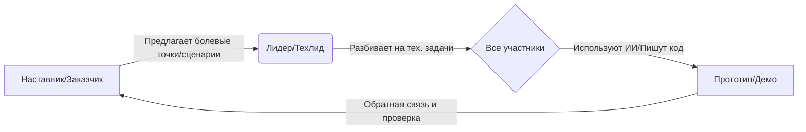

# Руководство по командному выравниванию


### 📌 Цель документа
Этот документ помогает **Наставникам (Community Admin), Лидерам (DKU Student) и Участникам (Volunteer)** быстро достичь взаимопонимания и наладить эффективный цикл сотрудничества. Независимо от наличия опыта программирования, это ваш старт в Хакатоне.


### 🚀 1. Основная модель сотрудничества: Цикл Сотрудничество-Обучение-Практика

Наше сотрудничество — это не односторонняя передача команд, а динамичный цикл:



#### 👥 Роли
*   **Наставник (Community Admin)**: **Компас**. Передает реальные потребности пациентов/семей (Пул потребностей), контролирует направление продукта, чтобы он "приземлился у постели больного", и отвечает на вопросы по мед. сценариям.
*   **Лидер (DKU Student)**: **Рулевой**. Управляет проектом, разбивает абстрактные потребности на GitHub Issues/Tasks, направляет участников в использовании Git, координирует прогресс, следит за качеством кода и соответствием требованиям.
*   **Участник (Volunteer)**: **Гребец**. Использует навыки (разработка, дизайн, мед. знания) вместе с ИИ-инструментами для создания кода, доков или дизайна для выполнения задач.


### 💡 2. Понимание потребностей и правила коммуникации

Наша цель — **решать реальные проблемы**, а не просто демонстрировать навыки.

#### 🏥 Источник потребностей (Where to look)
См. `/references/seed-ideas-pool`. Основные направления:
*   **Матрица семицветных карт**: Управление осложнениями, интерпретация состояния, душевное исцеление.
*   **Болевые точки сообщества**: Перевод мед. отчетов на "человеческий язык", предупреждение о мошенничестве в терапии, управление питанием/лекарствами.

#### 🛡️ Коммуникация и Красные линии (The Rules)
1.  **Никаких реальных данных**: Разработка и тесты **ОБЯЗАНЫ** использовать Mock-данные или обезличенные данные от LLM. Строго запрещено загружать реальные имена пациентов или мед. карты.
2.  **Эмпатичная коммуникация**: Многие в сообществе — пациенты или их семьи. Будьте терпеливы и уважительны. Избегайте холодного тех. жаргона; спрашивайте "Как это поможет решить вашу проблему?".
3.  **Дух Open Source**: Проекты по умолчанию используют MIT или подобные лицензии, чтобы приносить пользу сообществу, а не для коммерческого закрытого использования.


### 🛠️ 3. Быстрый старт в GitHub

Мы используем GitHub для хостинга кода и сотрудничества.

#### Обзор процесса (The Flow)
1.  **Clone (Клон)**: Скачать проект локально.
2.  **Branch (Ветка)**: **НЕ меняйте main/master напрямую!** Создавайте новые ветки для задач, например `feature-login-page`.
3.  **Commit (Коммит)**: Сохранить изменения.
4.  **Pull Request (PR)**: Запрос на слияние вашей работы в основную ветку.

#### Шпаргалка (Cheatsheet)
```bash
# Руководство по командному выравниванию
git clone https://github.com/your-repo.git
cd your-repo

# Руководство по командному выравниванию
git checkout -b feature-login

# Руководство по командному выравниванию

# Руководство по командному выравниванию
git add .
git commit -m "feat: complete login page layout"

# Руководство по командному выравниванию
git push origin feature-login
```
*💡 **Совет Лидеру**: После того как участники отправят PR, Лидер должен провести Code Review на GitHub и сделать Merge, если все ок.*


### 🤖 4. Руководство по Vibe Coding / Qoder CLI

Чтобы помочь нетехническим участникам вносить вклад и повысить эффективность разработчиков, мы поощряем использование ИИ-инструментов. Особая благодарность партнерам техподдержки:
*   **ИИ-инструмент кодинга (Qoder)**: [https://qoder.com/](https://qoder.com/)
*   **Vibe Coding (Weavefox)**: [https://www.weavefox.cn/](https://www.weavefox.cn/)

#### Что такое Vibe Coding?
**"Кодинг по наитию"**. Вам не нужно знать каждую строчку синтаксиса, просто четко скажите ИИ, что вы хотите, ИИ сгенерирует код, а вы проверите/поправите.

#### Как использовать Qoder CLI / AI Assistant?
1.  **Четкие промпты**:
    *   ❌ Плохо: "Напиши веб-страницу."
    *   ✅ Хорошо: "Мне нужна мобильная веб-страница с полем ввода 'уровень сахара' и кнопкой 'Сохранить'. Клик сохраняет данные в консоль и очищает поле. Используй TailwindCSS, стиль современный и чистый."
2.  **Итерация**:
    *   Сгенерировать базу -> Запустить и проверить -> Найти проблемы -> Сказать ИИ исправить -> Запустить снова.
3.  **Обработка ошибок**:
    *   Если видите ошибки, скопируйте их ИИ: "У меня такая ошибка [текст ошибки], исправь пожалуйста."

#### Совет для нетехнических участников
*   Представьте себя **Продуктовым менеджером** или **Архитектором**.
*   Ваш ключевой навык — **Определение проблем** и **Приемка результатов**.
*   Оставьте скучный кодинг ИИ; сосредоточьтесь на плавном опыте и удовлетворении потребностей Наставника.


### 📅 5. Действуй сейчас (Action Items)

1.  **Все**: Вступить в группу, представиться одним предложением.
2.  **Лидер**: Создать репозиторий GitHub, загрузить пустой `README.md`, пригласить участников как Collaborators.
3.  **Наставник**: Выбрать конкретное направление из Пула потребностей (напр.: простой "Напоминатель срока годности лекарств").
4.  **Участники**: 
    *   Установить среду (Node.js, Git, Cursor/VSCode).
    *   Запустить "Hello World": Клон репо -> Изменить одну строку -> Отправить PR -> Лидер мерджит.

> **Мы не соревнуемся в скорости написания кода, мы соревнуемся в том, кто быстрее доставит тепло технологий тем, кто в этом нуждается.**
> *Let's Hack for Good!*
